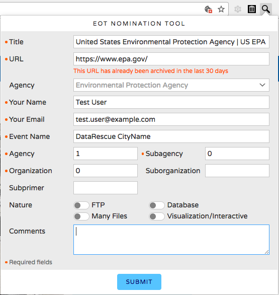

[](https://github.com/edgi-govdata-archiving/overview/blob/master/CONDUCT.md) [](https://chrome.google.com/webstore/detail/nominationtool/abjpihafglmijnkkoppbookfkkanklok)

# 2016 Presidental Harvest - Nomination Tool

Developers, please see [Contributing and Forking This Tool](./Contributing.md)  
For usage, skip straight to [Usage Instructions](#usage)

## What is this?

Nomination tool Chrome Bookmarklet for [End of Term Presidental Harvest 2016](http://digital2.library.unt.edu/nomination/eth2016/about/).

> The Library of Congress, California Digital Library, University of North Texas Libraries, Internet Archive, George Washington University Libraries, Stanford University Libraries, and the U.S. Government Publishing Office have joined together for a collaborative project to preserve public United States Government web sites at the end of the current presidential administration ending January 20, 2017. This harvest is intended to document federal agencies' presence on the World Wide Web during the transition of Presidential administrations and to enhance the existing collections of the partner institutions.

> In this collaboration, the partners will structure and execute a comprehensive harvest of the Federal Government .gov domain. The Internet Archive will crawl broadly across the entire .gov domain. The University of North Texas and the California Digital Library, will supplement and extend the broad comprehensive crawl with focused, in-depth crawls based on prioritized lists of URLs, including social media. This dual-edged approach seeks to capture a comprehensive snapshot of the Federal government on the Web at the close of the current administration.

> Harvested content from previous End of Term Presidential Harvests is available at http://eotarchive.cdlib.org/.

Also see NYT's [_Harvesting Government History, One Web Page At A Time_](http://www.nytimes.com/2016/12/01/nyregion/harvesting-government-history-one-web-page-at-a-time.html).

This was in preparation for [Guerrilla Archiving: Saving Environmental Data from Trump](https://www.facebook.com/events/1828129627464671/) hosted at the University of Toronto on Dec 17, 2016.

This Chrome Extension is used for keeping track of what everyone is working on, once clicked the extension will record the URL you have just submitted for nomination to a [Google Form](https://docs.google.com/forms/d/e/1FAIpQLSf6Yc_p3VjHELQOactjYGJIGpU4uwBg5omZAZsbTQZXbT87tQ/viewform).

## Installation

We have published a version of the chrome Extension [on the Chrome Store](https://chrome.google.com/webstore/detail/nominationtool/abjpihafglmijnkkoppbookfkkanklok). Just click on that link in Chrome and hit ```add to Chrome```!

## Usage

1. Go to the URL that you wish to nominate.

1. Click the extension icon near the address bar (the icon looks like a black magnifying glass). A form will pop up beneath the icon. The title and URL will be autofilled with the current URL of the tab. Once you have submitted the form, your name/email/event information will also be pre-filled.

1. If you're working with an EDGI subprimer ([found here](https://envirodatagov.org/agency-forecasts/)), you should fill-in the corresponding Agency Office Code that relates to particular subprimers. Filling in the code will autocomplete the agency in the dropdown above.

1. Fill in the subprimer field with the corresponding numbered link in the subprimer you're working with. 

1. If the page contains uncrawlable content, it can be indicated by selecting one or a combination of the four toggles. On subsequent uses, these will be pre-filled, though you can alter them at any time just by choosing something else.

  

  Examples of each of the four toggles to indicate uncrawlable content are:  
    1) **FTP** [ftp.aoml.noaa.gov/phod/pub/ARGO_FTP/argo](ftp://ftp.aoml.noaa.gov/phod/pub/ARGO_FTP/argo)  
    2) **Many Files** [nohrsc.noaa.gov/gisdatasets/](https://www.nohrsc.noaa.gov/gisdatasets/)  
    3) **Database** [eere.energy.gov/library](https://www1.eere.energy.gov/library/default.aspx)  
    4) **Visualization/Interactive** [nohrsc.noaa.gov/interactive/html/map.html](https://www.nohrsc.noaa.gov/interactive/html/map.html)  

After submitting, move on to the next URL and click the extension icon again. Happy Archiving!!!
